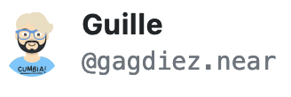
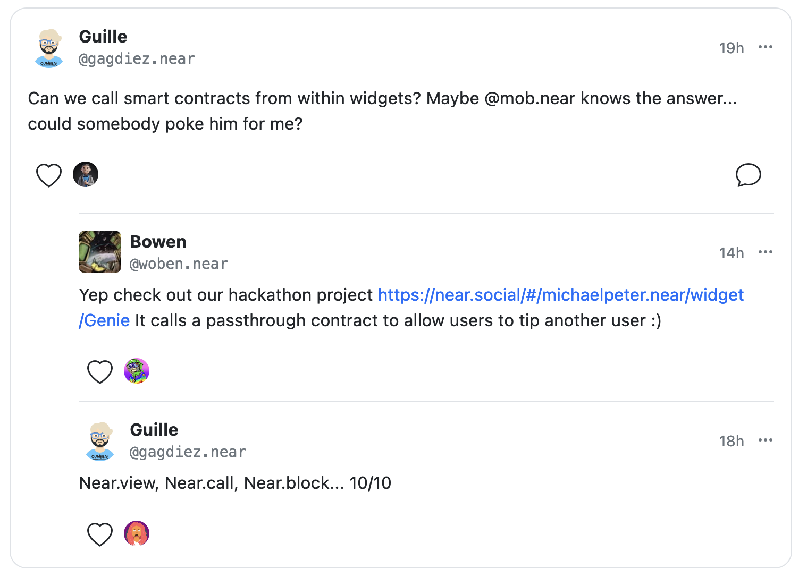
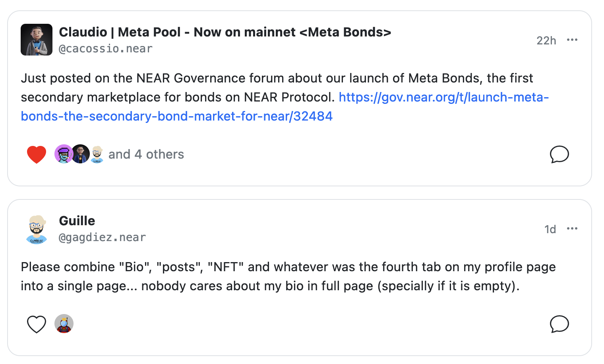

## [Profile.ShortInlineBlock](https://near.social/#/mob.near/widget/WidgetSource?src=mob.near/widget/Profile.ShortInlineBlock)

### Input
```js
{accountId: AccountId}
```

### Returns
A button-like render of the user's profile.



### 

---

## [MainPage.Post](https://near.social/#/mob.near/widget/WidgetSource?src=mob.near/widget/MainPage.Post)

### Input: 
```js
{
    accountId: AccountId,
    blockHeight: BlockId,
}
```

### Returns
A rendered post, including all its comments and related metadata (e.g. likes)



---

## [MainPage.Feed](https://near.social/#/mob.near/widget/WidgetSource?src=mob.near/widget/MainPage.Feed)

#### Input: 
```js
{ accounts: AccountId[] }
```

#### Returns
All posts for a set of `accounts`

